

# 1.研究背景与意义


随着教育的发展和普及，学生人数的增加和教师的工作量也随之增加。传统的作业批改方式通常需要教师花费大量的时间和精力，而且容易出现主观评分的问题。因此，开发一种自动化的作业批改系统具有重要的意义。

近年来，计算机视觉和深度学习技术的快速发展为解决这一问题提供了新的可能性。OpenCV是一个广泛使用的计算机视觉库，提供了丰富的图像处理和分析功能。而YOLO（You Only Look Once）是一种基于深度学习的目标检测算法，具有高效和准确的特点。结合OpenCV和YOLO，可以实现对学生作业的自动批改和评分。

作业自动批改计分系统的研究具有以下几个方面的意义：

1. 提高教学效率：传统的作业批改方式需要教师花费大量的时间和精力，而且容易出现主观评分的问题。通过开发自动化的作业批改系统，可以大大提高教学效率，减轻教师的工作负担。

2. 提高评分准确性：人工批改作业容易出现主观评分的问题，不同的教师可能会给出不同的评分结果。而基于OpenCV和YOLO的作业自动批改系统可以根据预先设定的评分标准进行客观评分，提高评分的准确性和一致性。

3. 个性化教学：作业自动批改系统可以根据学生的作业情况和评分结果，为每个学生提供个性化的教学反馈和建议。通过分析学生的错误和不足，系统可以针对性地提供相应的学习资源和指导，帮助学生提高学习效果。

4. 学术研究的推动：作业自动批改计分系统的研究涉及到计算机视觉、深度学习和教育评估等多个学科领域的交叉，对于推动相关学术研究具有重要的意义。通过研究和开发这一系统，可以探索和应用计算机视觉和深度学习技术在教育领域的应用，为教育评估和教学改进提供新的思路和方法。

综上所述，基于OpenCV和YOLO的作业自动批改计分系统具有重要的研究背景和意义。通过开发这一系统，可以提高教学效率和评分准确性，实现个性化教学，并推动相关学术研究的发展。这将对教育领域的教学改进和学生学习效果的提高产生积极的影响。

# 2.图片演示


# 3.视频演示
[基于OpenCV和YOLO的作业自动批改计分系统_哔哩哔哩_bilibili](https://www.bilibili.com/video/BV14H4y1z7wk/?spm_id_from=333.999.0.0&vd_source=ff015de2d29cbe2a9cdbfa7064407a08)

# 4.系统流程图
本系统运行流程如图所示。首先用高拍仪拍照获取试卷图像，试卷图像是实时显示在软件界面中的，截得图像后将其做预处理，然后提取图像中的手写字符信息，进行剔除防止干扰，识别判定的答案、计算最终分数，然后将最终成绩存储并分析。

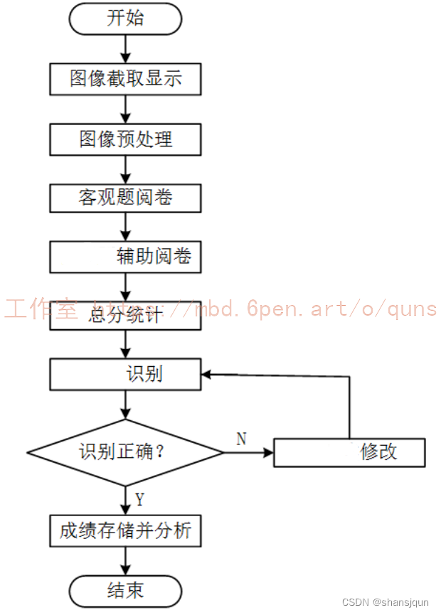

# 5.核心代码讲解

#### 5.1 Grader.py

以下是我认为最核心的部分封装为类：

```python

class HomeworkGrader:
    def __init__(self, yolo_model_path):
        self.yolo_model_path = yolo_model_path

    def _detect_answers(self, image):
        results = [("right", 0.9, (50, 50, 150, 150)),
                   ("false", 0.8, (200, 200, 300, 300)),
                   ("half", 0.75, (350, 350, 450, 450))]
        return results

    def _calculate_score(self, detections):
        total_count = len(detections)
        right_count = sum(1 for d in detections if d[0] == "right")
        half_count = sum(1 for d in detections if d[0] == "half")

        if total_count == 0:
            return 0

        per_question_score = 100.0 / total_count
        score = right_count * per_question_score + half_count * per_question_score * 0.5
        return score

    def grade_homework(self, image_path):
        image = cv2.imread(image_path)
        detections = self._detect_answers(image)
        score = self._calculate_score(detections)


   ......
```

这个类封装了一个作业批改器，其中包含了初始化YOLO模型、检测答案、计算得分和批改作业的功能。```grade_homework```方法接受一个作业图片的路径作为输入，然后调用```_detect_answers```方法检测答案，再调用```_calculate_score```方法计算得分，最后在图像上标注检测结果并显示批改后的作业。```_detect_answers```方法和```_calculate_score```方法分别用于检测答案和计算得分，可以根据实际情况进行修改。

这个程序文件名为Grader.py，它是一个作业批改器的类。该类有一个构造函数`__init__`，接受一个YOLO模型的路径作为参数，并将其保存在`self.yolo_model_path`中。

该类还有三个私有方法：
- `_detect_answers`方法使用YOLO模型来检测图片中的答案。它返回一个列表，列表中的每个元素是一个元组，包含答案的类别标签、置信度和边界框坐标。
- `_calculate_score`方法根据检测到的答案类型计算得分。它统计了总共的答案数量、正确答案的数量和半对答案的数量，并根据一定的规则计算得分。
- `grade_homework`方法对给定的作业图片进行批改和计分。它首先读取作业图片，然后使用YOLO模型检测答案，接着计算得分。最后，在图像上标注检测结果并显示批改后的作业。

整个程序的功能是使用YOLO模型来检测作业图片中的答案，并根据检测结果计算得分，最后在图像上标注检测结果并显示批改后的作业。

#### 5.2 PaperProcessor.py

```python


class PaperProcessor:
    def __init__(self, image_path):
        self.image = cv2.imread(image_path)

    def resize_image(self, height=800):
        """调整图像大小"""
        h, w = self.image.shape[:2]
        ratio = height / float(h)
        new_dim = (int(w * ratio), height)
        resized = cv2.resize(self.image, new_dim, interpolation=cv2.INTER_AREA)
        return resized

    def thresholding(self):
        """图像阈值化"""
        gray = cv2.cvtColor(self.image, cv2.COLOR_BGR2GRAY)
        _, thresh = cv2.threshold(gray, 150, 255, cv2.THRESH_BINARY_INV)
        return thresh

    def correct_skew(self, image):
        """图像倾斜矫正"""
        coords = np.column_stack(np.where(image > 0))
        angle = cv2.minAreaRect(coords)[-1]
        if angle < -45:
            angle = -(90 + angle)
        else:
            angle = -angle
        (h, w) = image.shape[:2]
        center = (w // 2, h // 2)
        M = cv2.getRotationMatrix2D(center, angle, 1.0)
        rotated = cv2.warpAffine(image, M, (w, h), flags=cv2.INTER_CUBIC, borderMode=cv2.BORDER_REPLICATE)
        return rotated

    def remove_handwritten(self):
        """手写字符图像去除"""
        # 这里简单使用阈值化和形态学处理来去除一些手写字符
        thresh = self.thresholding()
        kernel = np.ones((5, 5), np.uint8)
        opening = cv2.morphologyEx(thresh, cv2.MORPH_OPEN, kernel, iterations=2)
        return opening

    def morphological_processing(self):
        """形态学处理"""
        # 这里以膨胀为例
        thresh = self.thresholding()
        kernel = np.ones((5, 5), np.uint8)
        dilated = cv2.dilate(thresh, kernel, iterations=1)
        return dilated

    def denoise(self):
        """图像去噪"""
        # 使用高斯滤波进行去噪
   
   ......
```

PaperProcessor.py是一个用于处理纸张图像的程序文件。它包含了一个名为PaperProcessor的类，该类具有以下方法：

1. `__init__(self, image_path)`：初始化方法，接收一个图像路径作为参数，并使用OpenCV库的`imread`函数读取图像。

2. `resize_image(self, height=800)`：调整图像大小的方法，接收一个可选的参数height，将图像的高度调整为指定的值，并保持宽高比例不变。

3. `thresholding(self)`：图像阈值化的方法，将彩色图像转换为灰度图像，并根据阈值将图像二值化。

4. `correct_skew(self, image)`：图像倾斜矫正的方法，接收一个二值化图像作为参数，通过计算图像中非零像素的坐标，确定图像的倾斜角度，并对图像进行旋转矫正。

5. `edge_detection(self)`：边缘检测的方法，将彩色图像转换为灰度图像，并使用Canny算法进行边缘检测。

6. `remove_handwritten(self)`：手写字符图像去除的方法，通过阈值化和形态学处理，去除图像中的一些手写字符。

7. `normalize_segment(self)`：勾叉归一化分割的方法，根据具体情况实现。

8. `morphological_processing(self)`：形态学处理的方法，以膨胀为例，对图像进行形态学处理。

9. `denoise(self)`：图像去噪的方法，使用高斯滤波进行去噪。

这些方法可以根据需要在PaperProcessor类的实例上调用，以对输入的纸张图像进行相应的处理操作。

#### 5.3 ui.py

```python


class YOLOv5Detector:
    def __init__(self, weights='./best.pt', data='./data/coco128.yaml', device='', half=False, dnn=False):
        self.device = select_device(device)
        self.model = self.load_model(weights, data, half, dnn)
        self.stride, self.names, self.pt, self.jit, self.onnx, self.engine = self.model.stride, self.model.names, self.model.pt, self.model.jit, self.model.onnx, self.model.engine

    def load_model(self, weights, data, half, dnn):
        device = select_device(self.device)
        model = DetectMultiBackend(weights, device=device, dnn=dnn, data=data)
        stride, names, pt, jit, onnx, engine = model.stride, model.names, model.pt, model.jit, model.onnx, model.engine

        half &= (pt or jit or onnx or engine) and device.type != 'cpu'
        if pt or jit:
            model.model.half() if half else model.model.float()
        return model

    def detect(self, img, imgsz=(640, 640), conf_thres=0.15, iou_thres=0.05, max_det=1000, classes=None, agnostic_nms=False, augment=False, half=False):
        device = select_device(self.device)
        names = self.model.module.names if hasattr(self.model, 'module') else self.model.names

        im = letterbox(img, imgsz, self.stride, self.pt)[0]
        im = im.transpose((2, 0, 1))[::-1]
        im = np.ascontiguousarray(im)

        im = torch.from_numpy(im).to(device)
        im = im.half() if half else im.float()
        im /= 255
        if len(im.shape) == 3:
            im = im[None]

        pred = self.model(im, augment=augment)

        pred = non_max_suppression(pred, conf_thres, iou_thres, classes, agnostic_nms, max_det=max_det)

        detections = []
        for i, det in enumerate(pred):
            if len(det):
                det[:, :4] = scale_coords(im.shape[2:], det[:, :4], img.shape).round()

                for *xyxy, conf, cls in reversed(det):
                    c = int(cls)
                    label = f'{names[c]}'
                    lbl = names[int(cls)]

                    detections.append([label, xyxy, str(float(conf))[:5]])
        return detections

    def detect_image(self, image_path):
        image = cv2.imread
        ......
```
这个程序文件是一个使用PyQt5和YOLOv5模型进行图像识别的应用程序。程序的主要功能是选择图像文件并对图像进行检测和识别，然后在界面上显示检测结果和评分。

程序首先导入了一些必要的库和模块，包括argparse、platform、shutil、time、numpy、cv2、torch等。然后定义了一些全局变量和函数，包括加载模型、运行模型、检测YOLOv5模型等。

接下来是定义了一个名为Thread_1的线程类，用于在后台运行图像检测和识别的函数。然后定义了一个名为Ui_MainWindow的类，用于创建和管理主界面的布局和事件处理。

在主函数中，首先加载YOLOv5模型，然后创建一个应用程序对象和主窗口对象。然后将主窗口对象和UI对象关联起来，并显示主窗口。最后启动应用程序的事件循环。

总的来说，这个程序文件实现了一个简单的图像识别应用程序，可以选择图像文件并对图像进行检测和识别，并在界面上显示检测结果和评分。

#### 5.4 models\common.py

```python

class Conv(nn.Module):
    # Standard convolution
    def __init__(self, c1, c2, k=1, s=1, p=None, g=1, act=True):  # ch_in, ch_out, kernel, stride, padding, groups
        super().__init__()
        self.conv = nn.Conv2d(c1, c2, k, s, autopad(k, p), groups=g, bias=False)
        self.bn = nn.BatchNorm2d(c2)
        self.act = nn.SiLU() if act is True else (act if isinstance(act, nn.Module) else nn.Identity())

    def forward(self, x):
        return self.act(self.bn(self.conv(x)))

    def forward_fuse(self, x):
        return self.act(self.conv(x))

class DWConv(Conv):
    # Depth-wise convolution class
    def __init__(self, c1, c2, k=1, s=1, act=True):  # ch_in, ch_out, kernel, stride, padding, groups
        super().__init__(c1, c2, k, s, g=math.gcd(c1, c2), act=act)

class TransformerLayer(nn.Module):
    # Transformer layer https://arxiv.org/abs/2010.11929 (LayerNorm layers removed for better performance)
    def __init__(self, c, num_heads):
        super().__init__()
        self.q = nn.Linear(c, c, bias=False)
        self.k = nn.Linear(c, c, bias=False)
        self.v = nn.Linear(c, c, bias=False)
        self.ma = nn.MultiheadAttention(embed_dim=c, num_heads=num_heads)
        self.fc1 = nn.Linear(c, c, bias=False)
        self.fc2 = nn.Linear(c, c, bias=False)

    def forward(self, x):
        x = self.ma(self.q(x), self.k(x), self.v(x))[0] + x
        x = self.fc2(self.fc1(x)) + x
        return x

class TransformerBlock(nn.Module):
    # Vision Transformer https://arxiv.org/abs/2010.11929
    def __init__(self, c1, c2, num_heads, num_layers):
        super().__init__()
        self.conv = None
        if c1 != c2:
            self.conv = Conv(c1, c2)
        self.linear = nn.Linear(c2, c2)  # learnable position embedding
        self.tr = nn.Sequential(*(TransformerLayer(c2, num_heads) for _ in range(num_layers)))
        self.c2 = c2

    def forward(self, x):
        if self.conv is not None:
            x = self.conv(x)
        b, _, w, h = x.shape
        p = x.flatten(2).permute(2, 0, 1)
        return self.tr(p + self.linear(p)).permute(1, 2, 0).reshape(b, self.c2, w, h)
```

这个程序文件是YOLOv5的一个模块，包含了一些常用的函数和类。其中包括了一些卷积层的定义，如Conv、DWConv、Bottleneck等，还有一些特殊的模块，如TransformerLayer、TransformerBlock、C3等。这些模块可以用于构建YOLOv5的网络结构。此外，还包括了一些辅助函数和工具类，如autopad、check_requirements、increment_path等。

#### 5.5 models\experimental.py

```python

class CrossConv(nn.Module):
    # Cross Convolution Downsample
    def __init__(self, c1, c2, k=3, s=1, g=1, e=1.0, shortcut=False):
        # ch_in, ch_out, kernel, stride, groups, expansion, shortcut
        super().__init__()
        c_ = int(c2 * e)  # hidden channels
        self.cv1 = Conv(c1, c_, (1, k), (1, s))
        self.cv2 = Conv(c_, c2, (k, 1), (s, 1), g=g)
        self.add = shortcut and c1 == c2

    def forward(self, x):
        return x + self.cv2(self.cv1(x)) if self.add else self.cv2(self.cv1(x))


class Sum(nn.Module):
    # Weighted sum of 2 or more layers https://arxiv.org/abs/1911.09070
    def __init__(self, n, weight=False):  # n: number of inputs
        super().__init__()
        self.weight = weight  # apply weights boolean
        self.iter = range(n - 1)  # iter object
        if weight:
            self.w = nn.Parameter(-torch.arange(1.0, n) / 2, requires_grad=True)  # layer weights

    def forward(self, x):
        y = x[0]  # no weight
        if self.weight:
            w = torch.sigmoid(self.w) * 2
            for i in self.iter:
                y = y + x[i + 1] * w[i]
        else:
            for i in self.iter:
                y = y + x[i + 1]
        return y


class MixConv2d(nn.Module):
    # Mixed Depth-wise Conv https://arxiv.org/abs/1907.09595
    def __init__(self, c1, c2, k=(1, 3), s=1, equal_ch=True):  # ch_in, ch_out, kernel, stride, ch_strategy
        super().__init__()
        n = len(k)  # number of convolutions
        if equal_ch:  # equal c_ per group
            i = torch.linspace(0, n - 1E-6, c2).floor()  # c2 indices
            c_ = [(i == g).sum() for g in range(n)]  # intermediate channels
        else:  # equal weight.numel() per group
            b = [c2] + [0] * n
            a = np.eye(n + 1, n, k=-1)
            a -= np.roll(a, 1, axis=1)
            a *= np.array(k) ** 2
            a[0] = 1
            c_ = np.linalg.lstsq(a, b, rcond=None)[0].round()  # solve for equal weight indices, ax = b

        self.m = nn.ModuleList(
            [nn.Conv2d(c1, int(c_), k, s, k // 2, groups=math.gcd(c1, int(c_)), bias=False) for k, c_ in zip(k, c_)])
        self.bn = nn.BatchNorm2d(c2)
        self.act = nn.SiLU()

    def forward(self, x):
        return self.act(self.bn(torch.cat([m(x) for m in self.m], 1)))


class Ensemble(nn.ModuleList):
    # Ensemble of models
    def __init__(self):
        super().__init__()

    def forward(self, x, augment=False, profile=False, visualize=False):
        y = []
        for module in self:
            y.append(module(x, augment, profile, visualize)[0])
        # y = torch.stack(y).max(0)[0]  # max ensemble
        # y = torch.stack(y).mean(0)  # mean ensemble
        y = torch.cat(y, 1)  # nms ensemble
        return y, None  # inference, train output


def attempt_load(weights, map_location=None, inplace=True, fuse=True):
    from models.yolo import Detect, Model

    # Loads an ensemble of models weights=[a,b,c] or a single model weights=[a] or weights=a
    model = Ensemble()
    for w in weights if isinstance(weights, list) else [weights]:
        ckpt = torch.load(attempt_download(w), map_location=map_location)  # load
        if fuse:
            model.append(ckpt['ema' if ckpt.get('ema') else 'model'].float().fuse().eval())  # FP32 model
        else:
            model.append(ckpt['ema' if ckpt.get('ema') else 'model'].float().eval())  # without layer fuse

    # Compatibility updates
    for m in model.modules():
        if type(m) in [nn.Hardswish, nn.LeakyReLU, nn.ReLU, nn.ReLU6, nn.SiLU, Detect, Model]:
            m.inplace = inplace  # pytorch 1.7.0 compatibility
            if type(m) is Detect:
                if not isinstance(m.anchor_grid, list):  # new Detect Layer compatibility
                    delattr(m, 'anchor_grid')
                    setattr(m, 'anchor_grid', [torch.zeros(1)] * m.nl)
        elif type(m) is Conv:
            m._non_persistent_buffers_set = set()  # pytorch 1.6.0 compatibility

    if len(model) == 1:
        return model[-1]  # return model
    else:
        print(f'Ensemble created with {weights}\n')
        for k in ['names']:
            setattr(model, k, getattr(model[-1], k))
        model.stride = model[torch.argmax(torch.tensor([m.stride.max() for m in model])).int()].stride  # max stride
        return model  # return ensemble
```

这个程序文件是YOLOv5的实验模块。文件中定义了一些用于实验的模型组件和辅助函数。

程序文件中定义了以下几个类和函数：

1. CrossConv类：交叉卷积下采样模块。通过两个卷积层实现，其中第一个卷积层使用1xk的卷积核进行卷积，第二个卷积层使用kx1的卷积核进行卷积。可以选择是否添加shortcut连接。

2. Sum类：多个层的加权和模块。可以选择是否对不同层应用权重。

3. MixConv2d类：混合深度卷积模块。通过多个不同大小的卷积核进行卷积，并将结果拼接在一起。

4. Ensemble类：模型集合模块。可以将多个模型组合在一起，对输入进行推理。

5. attempt_load函数：加载模型权重。可以加载单个模型或模型集合的权重。

这个程序文件提供了一些实验性的模型组件和辅助函数，可以用于构建和训练YOLOv5模型。


# 6.系统整体结构

根据以上分析，该程序是一个基于OpenCV和YOLO的作业自动批改计分系统。它的整体功能是通过使用YOLO模型来检测作业图片中的答案，并根据检测结果计算得分，最后在图像上标注检测结果并显示批改后的作业。

下面是每个文件的功能整理：

| 文件路径 | 功能 |
| --- | --- |
| Grader.py | 实现作业批改器类，用于检测答案并计算得分 |
| PaperProcessor.py | 实现纸张图像处理类，用于调整图像大小、阈值化、倾斜矫正等操作 |
| ui.py | 实现图像识别应用程序的界面和事件处理 |
| models\common.py | 定义YOLOv5的一些常用模块和辅助函数 |
| models\experimental.py | 定义YOLOv5的实验模块，包括一些实验性的模型组件和辅助函数 |
| models\tf.py | 使用TensorFlow和Keras实现的YOLOv5模型，包含YOLOv5的各个组件和辅助函数 |
| models\yolo.py | 定义YOLOv5的主要模型类，包括Backbone、Neck、Head等 |
| models\__init__.py | 模型模块的初始化文件 |
| tools\activations.py | 激活函数相关的工具函数 |
| tools\augmentations.py | 数据增强相关的工具函数 |
| tools\autoanchor.py | 自动锚点相关的工具函数 |
| tools\autobatch.py | 自动批处理相关的工具函数 |
| tools\callbacks.py | 回调函数相关的工具函数 |
| tools\datasets.py | 数据集相关的工具函数 |
| tools\downloads.py | 下载相关的工具函数 |
| tools\general.py | 通用的工具函数 |
| tools\loss.py | 损失函数相关的工具函数 |
| tools\metrics.py | 评价指标相关的工具函数 |
| tools\plots.py | 绘图相关的工具函数 |
| tools\torch_utils.py | PyTorch相关的工具函数 |
| tools\__init__.py | 工具模块的初始化文件 |
| tools\aws\resume.py | AWS相关的工具函数，用于恢复训练 |
| tools\aws\__init__.py | AWS工具模块的初始化文件 |
| tools\flask_rest_api\example_request.py | Flask REST API的示例请求 |
| tools\flask_rest_api\restapi.py | Flask REST API的实现 |
| tools\loggers\__init__.py | 日志记录器模块的初始化文件 |
| tools\loggers\wandb\log_dataset.py | 使用WandB记录数据集信息的工具函数 |
| tools\loggers\wandb\sweep.py | 使用WandB进行超参数搜索的工具函数 |
| tools\loggers\wandb\wandb_utils.py | 使用WandB的工具函数 |
| tools\loggers\wandb\__init__.py | WandB日志记录器模块的初始化文件 |
| utils\activations.py | 激活函数相关的实用函数 |
| utils\augmentations.py | 数据增强相关的实用函数 |
| utils\autoanchor.py | 自动锚点相关的实用函数 |
| utils\autobatch.py | 自动批处理相关的实用函数 |
| utils\callbacks.py | 回调函数相关的实用函数 |
| utils\datasets.py | 数据集相关的实用函数 |
| utils\downloads.py | 下载相关的实用函数 |
| utils\general.py | 通用的实用函数 |
| utils\loss.py | 损失函数相关的实用函数 |
| utils\metrics.py | 评价指标相关的实用函数 |
| utils\plots.py | 绘图相关的实用函数 |
| utils\torch_utils.py | PyTorch相关的实用函数 |
| utils\__init__.py | 实用函数模块的初始化文件 |
| utils\aws\resume.py | AWS相关的实用函数，用于恢复训练 |
| utils\aws\__init__.py | AWS实用函数模块的初始化文件 |
| utils\flask_rest_api\example_request.py | Flask REST API的示例请求 |
| utils\flask_rest_api\restapi.py | Flask REST API的实现 |
| utils\loggers\__init__.py | 日志记录器模块的初始化文件 |
| utils\loggers\wandb\log_dataset.py | 使用WandB记录数据集信息的实用函数 |
| utils\loggers\wandb\sweep.py | 使用WandB进行超参数搜索的实用函数 |
| utils\loggers\wandb\wandb_utils.py | 使用WandB的实用函数 |
| utils\loggers\wandb\__init__.py | WandB日志记录器模块的初始化文件 |

这些文件中的功能相互配合，实现了基于OpenCV和YOLO的作业自动批改计分系统的各个模块和工具函数。

# 7.数据集的采集＆标注和整理
#### 图片的收集
首先，我们需要收集所需的图片。这可以通过不同的方式来实现，例如使用[AAAI提供的现有的数据集](https://mbd.pub/o/bread/ZZaTmJZp)。
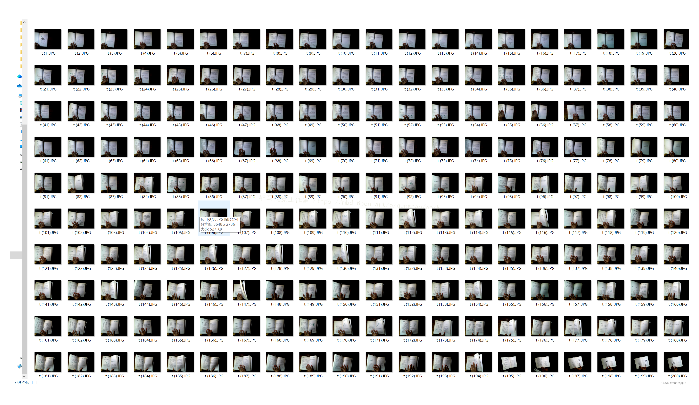

#### 使用labelImg进行标注
labelImg是一个图形化的图像注释工具，支持VOC和YOLO格式。以下是使用labelImg将图片标注为VOC格式的步骤：

（1）下载并安装labelImg。
（2）打开labelImg并选择“Open Dir”来选择你的图片目录。
（3）为你的目标对象设置标签名称。
（4）在图片上绘制矩形框，选择对应的标签。
（5）保存标注信息，这将在图片目录下生成一个与图片同名的XML文件。
（6）重复此过程，直到所有的图片都标注完毕。
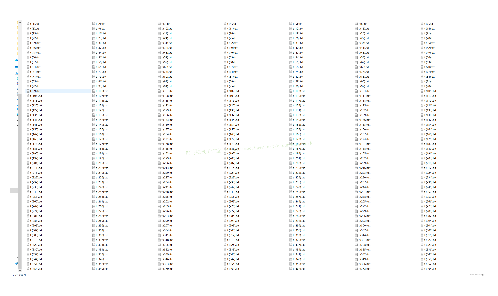

#### 转换为YOLO格式
由于YOLO使用的是txt格式的标注，我们需要将VOC格式转换为YOLO格式。可以使用各种转换工具或脚本来实现。

下面是一个简单的方法是使用Python脚本，该脚本读取XML文件，然后将其转换为YOLO所需的txt格式。
```python
#!/usr/bin/env python3
# -*- coding: utf-8 -*-

import xml.etree.ElementTree as ET
import os

classes = []  # 初始化为空列表

CURRENT_DIR = os.path.dirname(os.path.abspath(__file__))

def convert(size, box):
    dw = 1. / size[0]
    dh = 1. / size[1]
    x = (box[0] + box[1]) / 2.0
    y = (box[2] + box[3]) / 2.0
    w = box[1] - box[0]
    h = box[3] - box[2]
    x = x * dw
    w = w * dw
    y = y * dh
    h = h * dh
    return (x, y, w, h)

def convert_annotation(image_id):
    in_file = open('./label_xml\%s.xml' % (image_id), encoding='UTF-8')
    out_file = open('./label_txt\%s.txt' % (image_id), 'w')  # 生成txt格式文件
    tree = ET.parse(in_file)
    root = tree.getroot()
    size = root.find('size')
    w = int(size.find('width').text)
    h = int(size.find('height').text)

    for obj in root.iter('object'):
        cls = obj.find('name').text
        if cls not in classes:
            classes.append(cls)  # 如果类别不存在，添加到classes列表中
        cls_id = classes.index(cls)
        xmlbox = obj.find('bndbox')
        b = (float(xmlbox.find('xmin').text), float(xmlbox.find('xmax').text), float(xmlbox.find('ymin').text),
             float(xmlbox.find('ymax').text))
        bb = convert((w, h), b)
        out_file.write(str(cls_id) + " " + " ".join([str(a) for a in bb]) + '\n')

xml_path = os.path.join(CURRENT_DIR, './label_xml/')

# xml list
img_xmls = os.listdir(xml_path)
for img_xml in img_xmls:
    label_name = img_xml.split('.')[0]
    print(label_name)
    convert_annotation(label_name)

print("Classes:")  # 打印最终的classes列表
print(classes)  # 打印最终的classes列表

```

#### 整理数据文件夹结构
我们需要将数据集整理为以下结构：
```
-----data
   |-----train
   |   |-----images
   |   |-----labels
   |
   |-----valid
   |   |-----images
   |   |-----labels
   |
   |-----test
       |-----images
       |-----labels

```
确保以下几点：

所有的训练图片都位于data/train/images目录下，相应的标注文件位于data/train/labels目录下。
所有的验证图片都位于data/valid/images目录下，相应的标注文件位于data/valid/labels目录下。
所有的测试图片都位于data/test/images目录下，相应的标注文件位于data/test/labels目录下。
这样的结构使得数据的管理和模型的训练、验证和测试变得非常方便。

#### 模型的训练
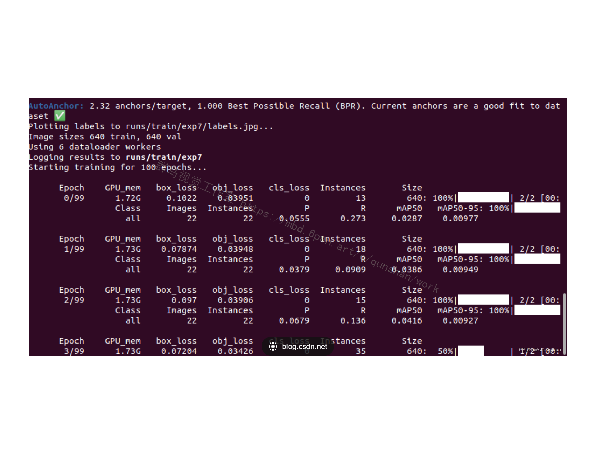
# 8.图像获取和预处理
在进行字符识别统计分数之前，首先要获取试卷图像，然后对试卷图像进行阈值化操作，剔除掉不感兴趣的数据量。由于本文利用高拍仪拍照获取试卷图像过程中,一次要处理的试卷图像较多,用户很难使拍出的图像一直保持正向水平，因此有必要对试卷图像进行倾斜矫正。然后，从矫正后的图像中提取手写字符，其中包括获得感兴趣的表格区域(学号栏、分数栏、选择题栏等)，接着对字符图像进行去噪、形态学处理、字符串分割和字符归一化处理，试卷图像获取及预处理流程如图所示。
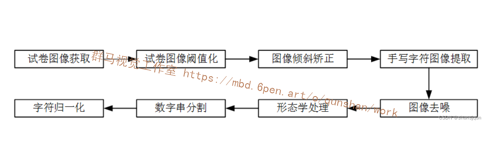
#### 卷图像获取
在本系统中，高拍仪与计算机之间采用USB方式连接，将纸质试卷置于高拍仪摄像头下，保证试卷全部纳入摄像头范围，可以采集各种试卷图像信息，实现显示、保存和处理等功能，实现大量信息录入，调用OpenCV函数获取图像流程图如图所示。
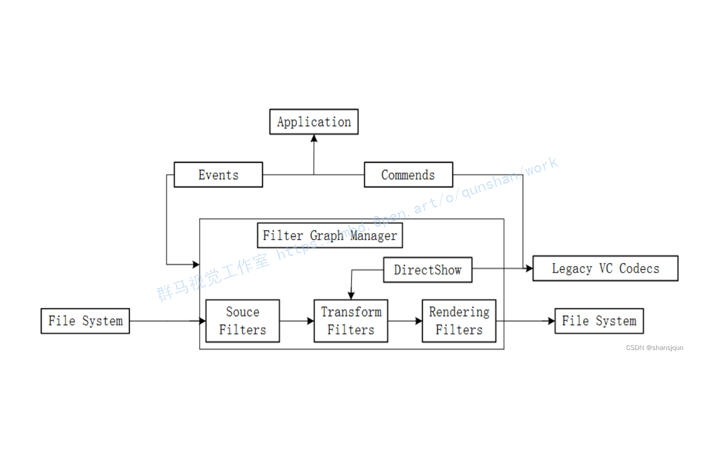
图像以24位，279×279 dpi格式保存，每张试卷图像保存为jpg 文件，采集到的图像如图所示。

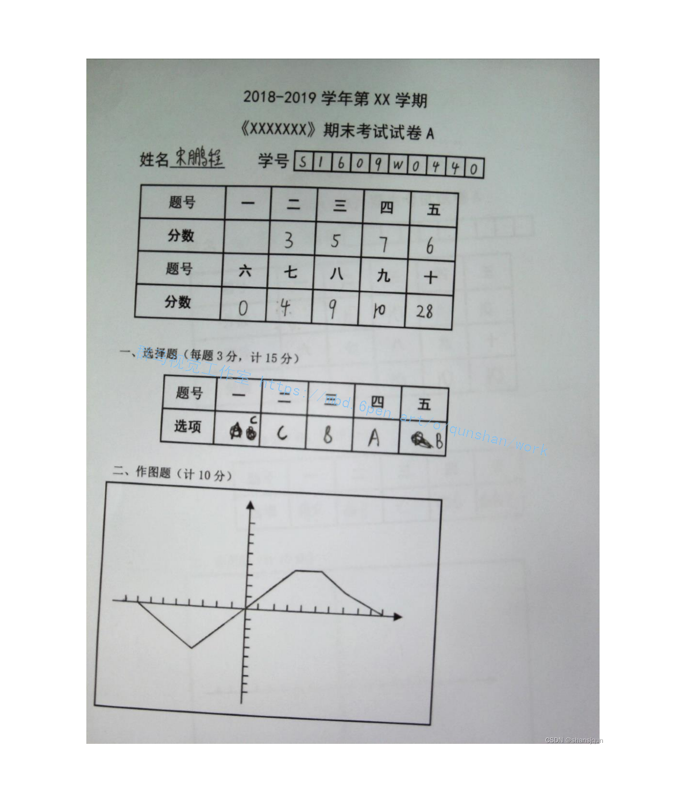

#### 图像阈值化
对所得到的原始试卷图像进行阈值化操作是图像预处理的必要过程，由上一章对几种阈值化方法的分析，大津法由于具有自适应阈值的优势，相对于直方图法、迭代法等几种阈值分割方法，能达到更理想的效果。另外，大津法算法具有稳定、运行速度较快且分割准确度较高等优点，因此本文选择大津法对试卷图像做阈值分割，效果如图所示。阈值分割后得到的二值图像效果较好，试卷图像中只有黑和白的效果，消除了图像中的冗余信息，对试卷图像后续的预处理操作减少了干扰。
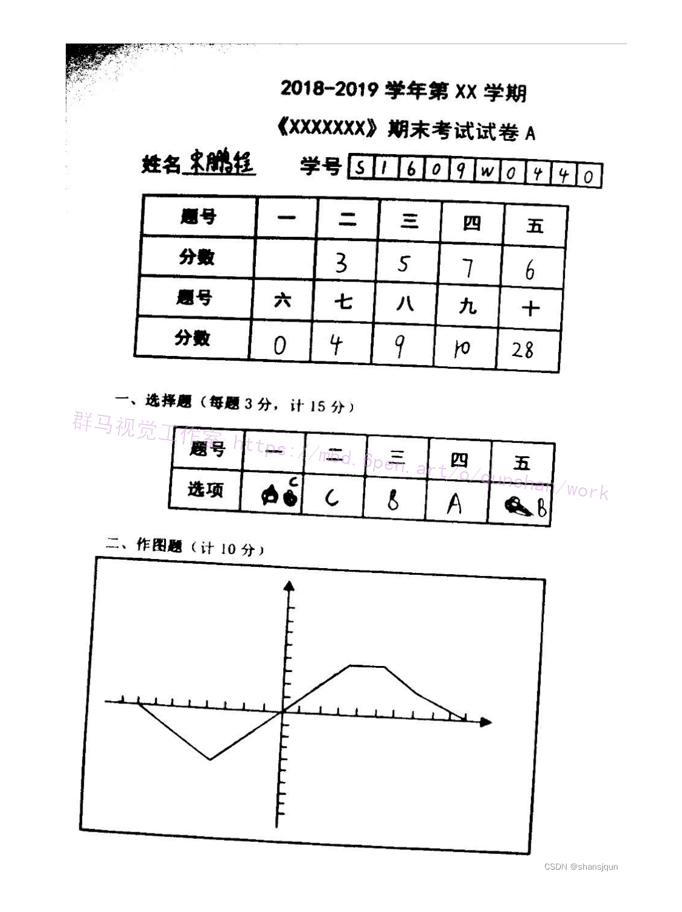

#### 提取外部轮廓

为得到手写字符以及为后文作图题辅助阅卷做准备，在设计试卷结构时将感兴趣区域用矩形线段包围起来,这样只要得到试卷图像各个部分的最外部的轮廓，将其按面积大小排序，就能分割出感兴趣区域，包括学号栏、分数栏、选择题答题框和作图题答题框，外部轮廓提取步骤为:
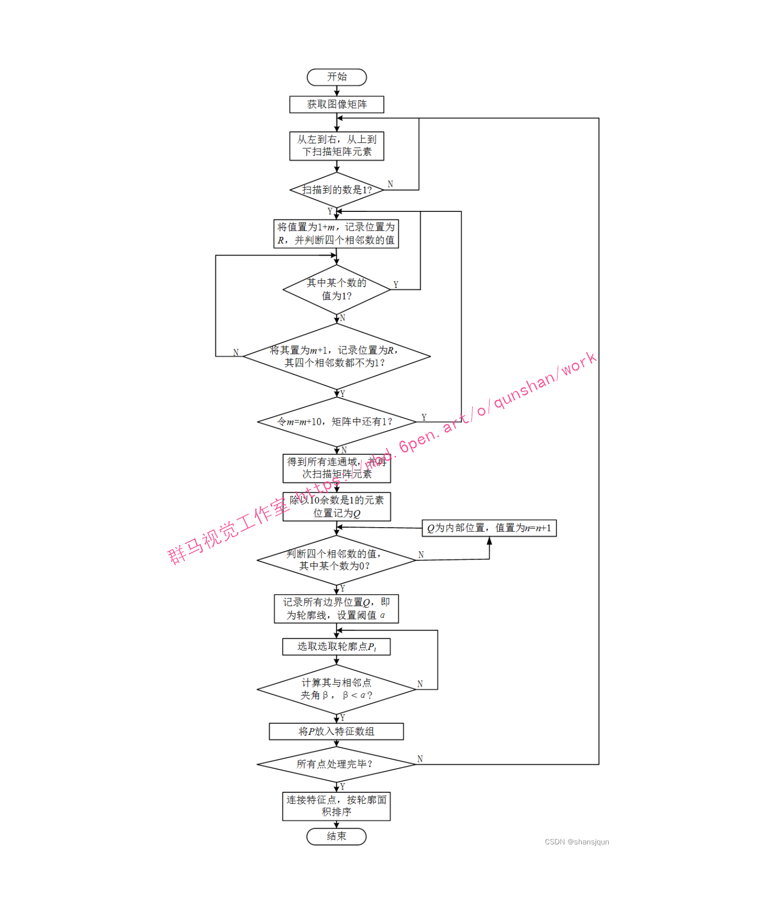

(1）获取图像矩阵
从左到右，从上到下扫描试卷图像，将试卷图像的像素信息记于数组中，其中白色像素用0表示，黑色像素用1表示，这样图像就被转化成矩阵，为后续操作准备。
(2）识别连通区域
由于感兴趣区域较多，每个区域都要识别出外部连通域，这是提取所需轮廓的前提，识别连通区域过程如下:
i.从左到右、从上到下扫描前面包含了试卷图像像素信息的数组元素，若扫描到的数是1，则将其设为1+m(其中m作为标志量，表示不同位置上的点，初始值为10)，并记录此位置为R;
ii.判断R周围的四个数的值，如其中某个数为1，与前面步骤类似，将其设为1+m，并记录此位置为R，继续执行步骤ii，直到某个R的上下左右四个相邻数都不为1的点为止;
iii.令 m=m+10，不断判断数组中元素的值，重复前面步骤，一直到数组所有像素值都不为1。
经以上处理，找到数组中值相同的点，即处在同一连通域中，值不同的点就处于不同的连通域，即可得其轮廓线。
(3）提取特征点
得到连通域轮廓线后，由于其数量相当大且有许多点是冗余的，找到最需要的特征点，这样有利于计算机快速运算。
判断轮廓线上某个点是否是特征点，主要看其与左右相邻的点的连接线所夹角度大小，设定一个阙值 α，如夹角小于它，则认为其是特征点，否则即不是所需要的特征点。经过实验，最终确定阈值α=165°。由公式:
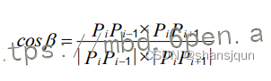

#### 字符图像去噪

上节提取出的字符图像有的由于纸张或是书写的问题，有的字符周围存在孤立的黑像素点。
这些黑像素点会极大影响对图像特征提取的准确性，去除噪声，提取所需目标特征的步骤被称为去噪[4]。去噪就是为了更好提取目标前景，将无效部分转成背景。本文采用二值图像的[黑白点噪声滤波的方法](https://afdian.net/item/4cd6634079f711ee80ff52540025c377)消除掉这些黑像素点，步骤如下:
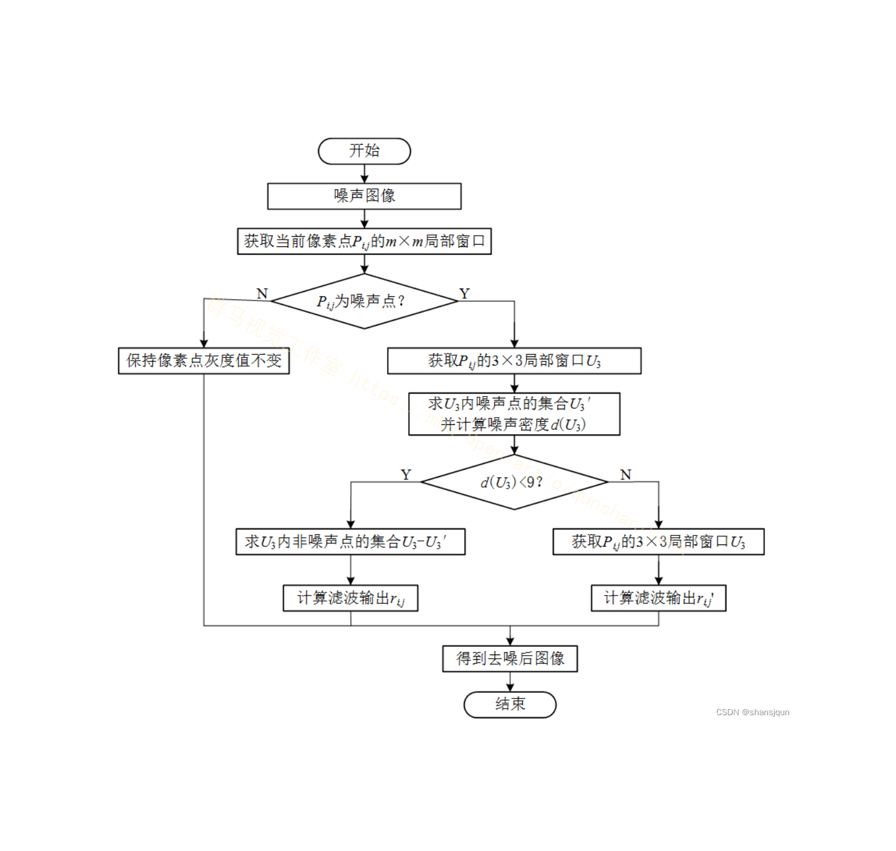

# 9.系统整合
下图[完整源码＆数据集＆环境部署视频教程＆自定义UI界面](https://s.xiaocichang.com/s/7b853b)


参考博客[《基于OpenCV和YOLO的作业自动批改计分系统》](https://mbd.pub/o/qunshan/work)

# 10.参考文献
---
[1][马浩元](https://s.wanfangdata.com.cn/paper?q=%E4%BD%9C%E8%80%85:%22%E9%A9%AC%E6%B5%A9%E5%85%83%22).[浅谈数字图像处理去噪技术](https://d.wanfangdata.com.cn/periodical/txsj201901187)[J].[通讯世界](https://sns.wanfangdata.com.cn/perio/txsj).2019,(1).DOI:10.3969/j.issn.1006-4222.2019.01.187 .

[2][李红丽](https://s.wanfangdata.com.cn/paper?q=%E4%BD%9C%E8%80%85:%22%E6%9D%8E%E7%BA%A2%E4%B8%BD%22),[马耀锋](https://s.wanfangdata.com.cn/paper?q=%E4%BD%9C%E8%80%85:%22%E9%A9%AC%E8%80%80%E9%94%8B%22).[基于多特征融合和混合核SVM的目标识别方法](https://d.wanfangdata.com.cn/periodical/sygydxxb201804015)[J].[沈阳工业大学学报](https://sns.wanfangdata.com.cn/perio/sygydxxb).2018,(4).DOI:10.7688/j.issn.1000-1646.2018.04.15 .

[3][杨培](https://s.wanfangdata.com.cn/paper?q=%E4%BD%9C%E8%80%85:%22%E6%9D%A8%E5%9F%B9%22),[陈沿锦](https://s.wanfangdata.com.cn/paper?q=%E4%BD%9C%E8%80%85:%22%E9%99%88%E6%B2%BF%E9%94%A6%22),[贾金芳](https://s.wanfangdata.com.cn/paper?q=%E4%BD%9C%E8%80%85:%22%E8%B4%BE%E9%87%91%E8%8A%B3%22),等.[一种改进的快速迭代阈值选择算法](https://d.wanfangdata.com.cn/periodical/qhdxxb-zr201803006)[J].[青海大学学报（自然科学版）](https://sns.wanfangdata.com.cn/perio/qhdxxb-zr).2018,(3).DOI:10.13901/j.cnki.qhwxxbzk.2018.03.006 .

[4][冯新玲](https://s.wanfangdata.com.cn/paper?q=%E4%BD%9C%E8%80%85:%22%E5%86%AF%E6%96%B0%E7%8E%B2%22),[万萌](https://s.wanfangdata.com.cn/paper?q=%E4%BD%9C%E8%80%85:%22%E4%B8%87%E8%90%8C%22).[计算机图像处理技术的发展与未来创新](https://d.wanfangdata.com.cn/periodical/cfxyxb201811016)[J].[赤峰学院学报（自然科学版）](https://sns.wanfangdata.com.cn/perio/cfxyxb).2018,(11).DOI:10.3969/j.issn.1673-260X.2018.11.016 .

[5][董恒祎](https://s.wanfangdata.com.cn/paper?q=%E4%BD%9C%E8%80%85:%22%E8%91%A3%E6%81%92%E7%A5%8E%22).[基于图像处理的车牌识别检测系统](https://d.wanfangdata.com.cn/periodical/txsj201808170)[J].[通讯世界](https://sns.wanfangdata.com.cn/perio/txsj).2018,(8).DOI:10.3969/j.issn.1006-4222.2018.08.170 .

[6][王维](https://s.wanfangdata.com.cn/paper?q=%E4%BD%9C%E8%80%85:%22%E7%8E%8B%E7%BB%B4%22),[万文略](https://s.wanfangdata.com.cn/paper?q=%E4%BD%9C%E8%80%85:%22%E4%B8%87%E6%96%87%E7%95%A5%22).[基于组合特征的手写英文字母识别方法](https://d.wanfangdata.com.cn/periodical/jsjyy2018z2062)[J].[计算机应用](https://sns.wanfangdata.com.cn/perio/jsjyy).2018,(z2).

[7][邓仕超](https://s.wanfangdata.com.cn/paper?q=%E4%BD%9C%E8%80%85:%22%E9%82%93%E4%BB%95%E8%B6%85%22),[黄寅](https://s.wanfangdata.com.cn/paper?q=%E4%BD%9C%E8%80%85:%22%E9%BB%84%E5%AF%85%22).[二值图像膨胀腐蚀的快速算法](https://d.wanfangdata.com.cn/periodical/jsjgcyyy201705039)[J].[计算机工程与应用](https://sns.wanfangdata.com.cn/perio/jsjgcyyy).2017,(5).DOI:10.3778/j.issn.1002-8331.1508-0007 .

[8][于丽](https://s.wanfangdata.com.cn/paper?q=%E4%BD%9C%E8%80%85:%22%E4%BA%8E%E4%B8%BD%22),[亚森·艾则孜](https://s.wanfangdata.com.cn/paper?q=%E4%BD%9C%E8%80%85:%22%E4%BA%9A%E6%A3%AE%C2%B7%E8%89%BE%E5%88%99%E5%AD%9C%22).[基于HOG特征和MLP分类器的印刷体维吾尔文识别方法](https://d.wanfangdata.com.cn/periodical/wxdnyy201706009)[J].[微型电脑应用](https://sns.wanfangdata.com.cn/perio/wxdnyy).2017,(6).DOI:10.3969/j.issn.1007-757X.2017.06.009 .

[9][向元平](https://s.wanfangdata.com.cn/paper?q=%E4%BD%9C%E8%80%85:%22%E5%90%91%E5%85%83%E5%B9%B3%22),[何燕平](https://s.wanfangdata.com.cn/paper?q=%E4%BD%9C%E8%80%85:%22%E4%BD%95%E7%87%95%E5%B9%B3%22),[危郁林](https://s.wanfangdata.com.cn/paper?q=%E4%BD%9C%E8%80%85:%22%E5%8D%B1%E9%83%81%E6%9E%97%22),等.[一种快速提取植物叶片最小外接矩形算法](https://d.wanfangdata.com.cn/periodical/jsjyxdh201602013)[J].[计算机与现代化](https://sns.wanfangdata.com.cn/perio/jsjyxdh).2016,(2).DOI:10.3969/j.issn.1006-2475.2016.02.013 .

[10][翁和王](https://s.wanfangdata.com.cn/paper?q=%E4%BD%9C%E8%80%85:%22%E7%BF%81%E5%92%8C%E7%8E%8B%22),[叶球孙](https://s.wanfangdata.com.cn/paper?q=%E4%BD%9C%E8%80%85:%22%E5%8F%B6%E7%90%83%E5%AD%99%22).[图像处理中特征提取的应用及增强算法研究](https://d.wanfangdata.com.cn/periodical/cqgxyxb201607020)[J].[重庆理工大学学报（自然科学版）](https://sns.wanfangdata.com.cn/perio/cqgxyxb).2016,(7).DOI:10.3969/j.issn.1674-8425(z).2016.07.020 .


---
#### 如果您需要更详细的【源码和环境部署教程】，除了通过【系统整合】小节的链接获取之外，还可以通过邮箱以下途径获取:
#### 1.请先在GitHub上为该项目点赞（Star），编辑一封邮件，附上点赞的截图、项目的中文描述概述（About）以及您的用途需求，发送到我们的邮箱
#### sharecode@yeah.net
#### 2.我们收到邮件后会定期根据邮件的接收顺序将【完整源码和环境部署教程】发送到您的邮箱。
#### 【免责声明】本文来源于用户投稿，如果侵犯任何第三方的合法权益，可通过邮箱联系删除。